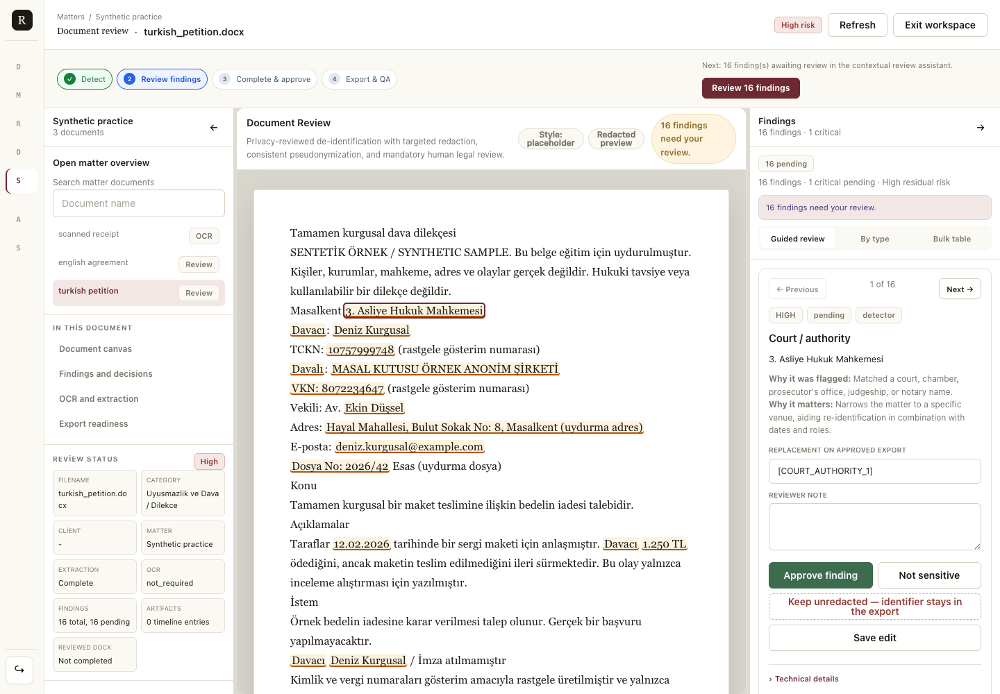

# Redact AI

**A local legal privacy document workstation.** Organize documents into matters,
inspect privacy findings beside the document, review what should be removed, and
prepare reviewed DOCX or PDF redactions with export checks.

Built for technically comfortable lawyers, legal-tech builders, developers and
founders evaluating a local review workflow, especially for Turkish legal documents.
You run it on your own computer. There is no hosted demo or document upload service.



*The real review workspace, using a bundled synthetic document. Findings await a
reviewer's decision; detecting them has not yet redacted the document.*

## Try it locally

Install and start [Docker Desktop](https://docs.docker.com/get-started/get-docker/)
(or a local Docker Engine with Compose). After cloning
[`remicaesar/redact-ai-legal`](https://github.com/remicaesar/redact-ai-legal) and
entering its directory, run one command in a shell (Git Bash or WSL on Windows):

```bash
./start.sh
```

It builds the app with **Tesseract, Turkish/English OCR data and Poppler**, initializes
and migrates SQLite, indexes three fictional practice documents, and starts the
workstation. It generates a unique session key and admin password for this install,
then **prints the login URL, username and password** when the app is ready.
Open **http://127.0.0.1:5055/login** and try **Synthetic practice**.

The first build downloads dependencies, so allow a few minutes depending on your
connection; repeat starts reuse the image cache. No Python setup or manually generated
key is needed. [Meet the three samples](samples/README.md), including a scanned PDF
with no text layer for the local OCR workflow.

Run `./start.sh` again to resume: it keeps your documents, review decisions and login.
If port 5055 is occupied, use `REDACT_PORT=5056 ./start.sh` and keep that setting for
later starts. Docker publishes the port only on `127.0.0.1`.

## Know the limits before using real documents

- **Rules-based and Turkish-tuned.** There is no ML model or LLM inference.
  **English name and address coverage is materially lower than Turkish coverage.**
  Read every document and add missed findings; few findings do not mean low risk.
- **Detection is not redaction. Redaction is not anonymization.** A human must review
  findings, OCR and export readiness. Context can still identify a person or matter
  after obvious identifiers are removed. No output is a legal opinion or a compliance
  certification.
- **Single-user, local workstation.** There is no multi-user isolation, hosted service,
  or public demo. Keep it on your own machine; do not expose its port to a LAN or the
  internet. Files and the database are unencrypted on local disk.
- **Prototype quality.** The bundled synthetic corpus checks rules, not real-world
  accuracy. OCR can misread text. DOCX/PDF export checks have limits; inspect the actual
  exported file. Legacy `.doc` extraction uses macOS `textutil` and is unavailable in
  the Linux Docker image; convert it locally to DOCX first.

Read the [threat model](#threat-model), [accuracy audit](#accuracy-audit),
[safety gates](#safety-gates) and [security policy](SECURITY.md) before using real files.

## Stop, resume and keep your work

```bash
docker compose stop          # keep this install's data
./start.sh                   # resume and print the same credentials
```

The Compose project keeps the database and `install.json` (admin credentials and
session key) in its `database` volume, and uploads/exports in its `documents` volume.
They survive rebuilds and container removal. Treat both volumes as confidential;
back up both together while the app is stopped. They are separate from a manual
Python install's `db/legal_documents.db` and `data/`. Run commands from the same clone
and keep the Compose project name stable to reuse the same volumes.

**Destructive reset, only when you want to discard this install:**
`./start.sh --reset` removes its database, uploads, exports and credentials, then
starts a fresh practice workspace. `docker compose down --volumes` also destroys
those volumes. Ordinary `./start.sh` never uses either destructive option.

For startup errors, run `docker compose logs workstation`. If Docker cannot connect,
start your local Docker engine first. If credentials are missing or do not match an
existing database, startup refuses to silently replace them: restore the matching
volume backup. Do not copy `.env` or real documents into the image; its build context
uses an allowlist. Dependency downloads need internet during build; the running app
performs document processing locally without an external document service.

## What the engine is

The detection engine is entirely rules-based: deterministic regular expressions, the
official check-digit algorithms for Turkish national ID (TCKN) and tax (VKN) numbers,
and a Turkish name gazetteer. There is no machine-learning model, no LLM inference, and
no outbound network call — the same document produces the same findings on every run,
and every finding cites the rule that produced it, which is what makes a redaction
decision auditable and reproducible for a lawyer who has to defend it later. "Redact
AI" is the product name, not a claim that a model is doing the reading. The point of the
tool is the opposite: it prepares a document so that a human can afterwards make a
deliberate, informed decision about sending it to an external LLM somewhere else.
Rules also mean rule-shaped limits — a pattern the gazetteer and the regular expressions
do not cover is a pattern the engine will miss, which is why every finding is gated on
human review.

## Run without Docker

Install Python 3.11+ and the local OCR binaries first:

```bash
# macOS
brew install tesseract tesseract-lang poppler
# Debian / Ubuntu
sudo apt-get install tesseract-ocr tesseract-ocr-tur tesseract-ocr-eng poppler-utils
```

Then, from the clone:

```bash
python3 -m venv .venv
source .venv/bin/activate
pip install -r requirements.txt
export LEGAL_ANALYZER_ADMIN_PASSWORD="change-this-local-password"
export LEGAL_ANALYZER_SECRET_KEY="$(python3 -c 'import secrets; print(secrets.token_hex(32))')"
python3 db/init_db.py        # keeps an existing database; use --reset to wipe (destructive)
python3 db/migrate.py
export LEGAL_ANALYZER_STOCK_DIR="$PWD/samples/documents"
python3 classify.py
python3 app.py
```

Open `http://127.0.0.1:5000/login` and sign in as `admin` with the password you set. Choose your own password; the string above is only a placeholder.

The scanner adds files to the index; it does not perform review or approve exports.
For your own local collection, change `LEGAL_ANALYZER_STOCK_DIR` in both the scanner
and the app environment. Keep it set when restarting so indexed paths resolve.

`LEGAL_ANALYZER_SECRET_KEY` signs session cookies and has **no default** — the app
refuses to start without it, because a known signing key lets anyone forge an admin
session. Generate one once and keep it in your environment or `.env`.

The first local admin is created from `LEGAL_ANALYZER_ADMIN_USERNAME` and `LEGAL_ANALYZER_ADMIN_PASSWORD`; the username defaults to `admin` when only the password is set.

## Threat Model

Read this before deciding how to run it, and before trusting anything it says
about a document's privacy status.

**What this is.** A local-first, single-user Flask workstation for one person
at a time on one machine. It classifies documents and detects privacy
findings with regular expressions plus check-digit validation (TCKN/VKN) and a
Turkish name gazetteer — not a machine-learning model, not an LLM, and it makes
no outbound network calls. Every finding requires a human reviewer to
approve it, dismiss it as not sensitive, keep it unredacted, or add one before it affects an export; detection is not
redaction, and redaction is not anonymization until a lawyer has assessed
residual re-identification risk (see "Output Positioning" below).

**What it does not defend against.**

- **Single-user, no multi-tenancy.** There is no concept of separating one
  user's documents, matters, or client roster from another's. Everyone who
  logs in shares the same document store.
- **Binds to `127.0.0.1` and trusts anyone who can reach the port.** The app
  assumes the only thing able to open a TCP connection to it is the person
  running it, on their own machine. It does not defend against another
  process, container, or user on the same host, and it has no protection
  suitable for exposing the port on a LAN or the public internet — putting it
  behind a reverse proxy or port-forward does not make it safe to do so.
  **Do not deploy this on a public host or a shared server as-is.**
- **Trusts local disk.** Documents, findings, exported artifacts, and the
  SQLite database are stored as plain files with no encryption at rest.
  Anyone with filesystem access to the machine (another local account, a
  backup, a stolen disk) can read everything the app can read, including
  documents still awaiting redaction review.
- **Session-cookie auth with three roles, not a hardened identity system.**
  Login uses server-side session cookies and three roles (`admin`, `reviewer`,
  `viewer` — see "Migrations and Local Access Control" below). There is no
  SSO, no MFA, and no per-document access control. Failed sign-ins ARE
  throttled (see "Login throttling" below), and state-changing requests
  require a CSRF token, but neither makes this an identity system you should
  expose to a network.
- **It is a prototype, not a certified anonymisation tool.** Recall and
  precision are measured against a small synthetic gold set, not audited
  against a legal or regulatory standard, and the release gate for external
  LLM use is a set of engineering checks, not a compliance certification (see
  "Accuracy Audit" and "Safety Gates" below). A "Low" residual-risk result or
  a "reviewed" export status is an engineering signal, not a legal opinion
  that a document is safe to share.

If you need multi-user isolation, encryption at rest, network-facing
authentication, or a compliance-audited pipeline, this project does not
provide them today. Run it on a single machine, for a single reviewer, behind
whatever OS-level access control that machine already has.

## Local WSGI operation

`python3 app.py` is Flask's development server: one process, no restart supervision, and written for localhost. For longer-lived local operation, use the WSGI entry point (the Docker command already does):

```bash
pip install gunicorn
export LEGAL_ANALYZER_SECRET_KEY="$(python3 -c 'import secrets; print(secrets.token_hex(32))')"
# Keep HTTPS unset for this plain HTTP loopback example.
gunicorn --workers 4 --bind 127.0.0.1:5000 wsgi:application
```

Configuration that matters here, all read from the environment (see `.env.example`):

- `LEGAL_ANALYZER_SECRET_KEY` — signs the session cookie. **There is no hardcoded fallback and no ephemeral one.** Unset, the app refuses to start and tells you how to generate a key. A process that will not boot cannot serve a forgeable session.
- `LEGAL_ANALYZER_HTTPS=1` — adds the `Secure` flag to the session cookie. Leave unset for plain http on loopback, where a `Secure` cookie is never sent and login fails silently.
- `LEGAL_ANALYZER_MAX_UPLOAD_BYTES` — request body cap, default 100 MB (the ceiling the ZIP extractor already enforces). Over it, the server returns 413.
- `LEGAL_ANALYZER_DEBUG=1` — re-enables the Werkzeug debugger on the dev server. Off by default because that debugger executes arbitrary code from the browser on any traceback.

Session cookies are `HttpOnly` and `SameSite=Strict` in all configurations. CSRF protection is enforced independently rather than relying on the browser default.

### CSRF protection

Every state-changing request (anything but `GET`/`HEAD`/`OPTIONS`/`TRACE`) must carry the session's CSRF token, either as an `X-CSRF-Token` header or a `csrf_token` form field. Pages get the token from a `<meta name="csrf-token">` tag; `static/csrf.js` wraps `fetch` so same-origin writes carry it without each call site opting in. The token rotates when a session logs in.

An API client obtains a token by issuing a `GET` first (for example `GET /login`) and reading it from the session, then sending it as the header on subsequent writes. Requests without a valid token get `403`.

### Login throttling

Failed sign-ins are recorded in `login_attempts` and throttled per `(username, address)` and per address:

- `LEGAL_ANALYZER_LOGIN_MAX_ATTEMPTS` — failures per username+address before lockout, default 5.
- `LEGAL_ANALYZER_LOGIN_MAX_ATTEMPTS_PER_ADDR` — failures per address across all usernames, default 20. This is what stops one address trying a single password against many accounts.
- `LEGAL_ANALYZER_LOGIN_WINDOW_SECONDS` — rolling window, default 900.

While locked out the endpoint returns `429` with a `Retry-After` header, and the correct password does not bypass it. A successful sign-in clears that caller's record. Counting per username *and* address is deliberate: counting by username alone would let anyone lock a known user out of their own account.

Behind a reverse proxy, `remote_addr` is the proxy unless it is configured to pass the client address through — in that case every caller shares one bucket, so size the per-address cap accordingly.

### What this deployment is and is not

This is single-tenant software. **Every authenticated user can see every document** — there is no per-user or per-organisation scoping in the schema — so this remains a single-user local workstation. WSGI or TLS does not add user isolation or make it suitable for a shared server. Do not expose it to a LAN or the public internet.


## Migrations and Local Access Control

Existing databases should be upgraded with:

```bash
python3 db/migrate.py
python3 db/migrate.py --status
```

The local app uses session login with three roles:

- `admin`: reviewer permissions plus audit-log access.
- `reviewer`: document review, OCR approval/rejection, manual findings, and redacted exports.
- `viewer`: read-only document list/detail access.

Sensitive actions are written to `audit_log` with actor, role, action, document id, result, timestamp, and sanitized metadata. Raw sensitive text, original-to-placeholder mappings, OCR text, passwords, and replacement text are not stored in audit metadata.

## Benchmark

Run the repeatable benchmark suite:

```bash
python3 benchmark.py
```

For a faster smoke benchmark:

```bash
python3 benchmark.py --limit 25 --api-iterations 5
```

The benchmark writes `benchmark_report.json` and covers document discovery, text extraction, classification, privacy analysis, API latency, database totals, and an optional canary-document check (set `LEGAL_ANALYZER_CANARY_PATTERN` to pin one known-sensitive document and assert it stays High-risk, CRITICAL, and blocked for external LLM use; unset it is reported as skipped).

To test local concurrent API behavior:

```bash
python3 benchmark.py --api-iterations 1000 --api-concurrency 50
```

This is still an in-process local benchmark. It does not replace production load testing with network latency, authentication, logging, workers, or a larger database.

## Accuracy Audit

Speed does not prove privacy quality. Run the mini-gold accuracy audit with manually labeled documents:

```bash
python3 accuracy_audit.py --labels gold/gold_labels.example.json
```

The bundled synthetic gold set covers 17 labeled documents (117 required labels): criminal investigation, civil petition, commercial contract, court judgment, enforcement file, employment dispute, medical malpractice, OCR-degraded scan text, notary power of attorney, KVKK data-subject request, lease agreement, and corporate resolution, plus three bare-name documents where person names appear WITHOUT a title or party-role prefix (running text, attendee/witness lists, signature blocks) — the hardest case for a rule-based detector. Against this set the detector currently holds recall 1.0, precision 0.701, `false_low_count = 0`, and `risk_shortfall_count = 0` (including post-OCR passes), but re-run `python3 accuracy_audit.py --labels gold/gold_labels.example.json` to regenerate those figures yourself rather than trusting the numbers in this README as the corpus grows. For a production-quality audit, replace or extend the set with manually labeled real documents — synthetic fixtures validate the rules, not real-world layout and language variance.

Against this set the detector currently holds recall 1.0, precision 0.701 (58 false positives out of 194 findings), `false_low_count = 0`, and `risk_shortfall_count = 0`; the post-OCR pass holds precision 0.643. **Recall alone is not the number to trust**: quote precision beside it whenever recall is quoted, since a detector can reach recall 1.0 trivially by over-flagging. And treat the recall figure itself with caution for a different reason — it is measured on the same synthetic gold set that the detection rules in `legal_analyzer/privacy.py` were tuned against (the gold labels and the rules have been edited in the same commits), so it is a fitted number, not a held-out one. It says the rules match their own test set, not that they generalize to unseen documents. For a production-quality audit, replace or extend the gold set with manually labeled real documents — synthetic fixtures validate the rules, not real-world layout and language variance. Track recall, precision, false negatives, and especially `false_low_count` and `risk_shortfall_count`.

Gold-label entries may include `ocr_text` to compare pre-OCR extraction with reviewer-accepted OCR text. The audit reports post-OCR metrics when those fields are present, while keeping `false_low_count = 0` as the target.

For Turkish-lawyer validation, include UYAP/UDF files, petitions, criminal complaints, contracts, scanned exhibits, and clean templates. Label TCKN, VKN, MERSIS, bar registration numbers, court/case numbers, investigation numbers, party roles, addresses, and UYAP terms.

Detection validates TCKN and VKN check digits to cut false positives, and recognizes numbered court chambers (for example `4. Asliye Ticaret Mahkemesi`, `Yargıtay 11. Hukuk Dairesi`), notary offices and judgeships (`24. Noterliği`, `3. Sulh Ceza Hakimliği`), bare 16-digit MERSIS numbers, witness/victim party roles, and apartment-style address fragments. Person names are caught from professional titles (`Av.`, `Dr.`, `Sayın`, including OCR-degraded `Av .`) and from party-role context (`Davacı Elif Şahin`, `şüpheli Kemal Arslan`, `kiracı Barış Tunç`), while all-caps company names stay in the company category. Address matching includes leading street names and survives internal numbering dots (`Bağdat Caddesi No: 41`, `45. Sokak No: 8`). Case-number keywords include `Takip No` and `Yevmiye No`. Keyword patterns spell out both the diacritic and the diacritic-free spelling of the Turkish keywords (for example `[İi]lçesi|ilcesi`, `beşiktaş|besiktas`, `İcra|Icra`). This is not about the dotted capital `İ`: CPython's `re` module carries an internal case-equivalence table that already relates all four i-forms (`i`, `I`, `ı`, `İ`) under `re.IGNORECASE` — measured, not assumed. What case-insensitivity cannot do is relate `ç`, `ğ`, `ö`, `ş` and `ü` to their ASCII counterparts, and Turkish legal text is routinely typed without diacritics, so those spellings are enumerated explicitly.

## Safety Gates

The current safety logic treats extraction gaps as unsafe:

- Extraction `Complete`: automated text pass completed.
- Extraction `Partial` or `Failed`: residual risk becomes `Unknown`.
- Any extraction warning blocks external LLM use until OCR/manual review.
- External hosted LLM use is allowed only when extraction is complete, residual risk is Low, critical findings are zero, no direct identifiers remain, redaction is completed, and human review is approved. There is no bypass of the approval — an undocumented `auto_mode_enabled` arm that substituted for it was removed (see `db/migrations/006_retire_auto_mode_bypass.sql`).
- Documents that fail any external LLM gate condition are blocked or require review.
- Detected findings are not the same thing as successful redaction.

## Review Workflow

The UI includes a Redaction Studio flow:

- Upload DOCX, PDF, UDF, TXT/MD, image, XLSX/PPTX, or ZIP files.
- Optionally assign uploads to a local client/matter workspace; otherwise they go to `Unassigned`.
- Run local extraction and privacy analysis immediately after upload.
- Open the new document directly in a dedicated Redaction Studio workspace.
- Review grouped findings, batch approve or dismiss lower-risk findings, and inspect export gates.
- Export a reviewed DOCX or coordinate-reviewed PDF redaction when the source and gates support it.

The UI also supports first-pass review actions:

- Queue OCR for failed or partial extraction.
- Run local OCR where local tools are available, or submit reviewer-supplied OCR text through the API.
- Accept or reject OCR output before it can affect privacy findings.
- Mark redaction complete.
- Approve or reject review.
- Reset review state.
- Export an actual reviewed DOCX redaction artifact for DOCX source files only.

Approval does not override the release gate. A document remains blocked unless every external LLM gate condition is satisfied.

### Deciding a finding

Each finding gets one of four decisions, and two of them are negative in different ways:

- **Approve** — redact it. The text is replaced in the export.
- **Not sensitive** (`dismissed`) — a false positive. The text stays, and release is not blocked.
  This is the common case: precision on the bundled gold set is 0.701, so roughly three in ten
  findings are things a reviewer should dismiss.
- **Keep unredacted** (`retained`) — the finding is real and you are deliberately leaving it in.
  The text stays **and release stays blocked**: a retained finding counts against residual risk,
  a retained direct identifier also trips the direct-identifier gate, and export QA reports the
  count instead of an unqualified pass. This decision is written to the audit log.
- **Add finding** (`added_by_reviewer`) — something the detector missed; redacted like an approval.

The distinction matters: `dismissed` says *the detector was wrong*, `retained` says *the detector
was right and I am accepting the risk*. Collapsing them into one "reject" is what allowed a real
identifier to pass the release gate.

## Matter Workspaces and Timeline

The workstation supports local matter-level privacy operations:

- `GET /api/matters`
- `POST /api/matters`
- `GET /api/matter/<id>`
- `POST /api/document/<id>/matter`
- `GET /api/document/<id>/artifacts`
- `GET /api/matter/<id>/review-matrix`

Matter pages group documents, finding review rows, OCR state, export/QA artifacts, and sanitized audit context without introducing a general legal chatbot. Artifact timeline entries record original uploads, accepted OCR, reviewed finding snapshots, reviewed DOCX exports, and DOCX QA reports. They are traceability records, not anonymization guarantees.

## OCR Review

OCR is local-first in this phase. The API stores OCR text separately by page and does not let OCR output affect findings, redaction completion, or external LLM readiness until a reviewer accepts it.

- `POST /api/document/<id>/ocr/queue`
- `POST /api/document/<id>/ocr/run`
- `POST /api/document/<id>/ocr/accept`
- `POST /api/document/<id>/ocr/reject`

`ocr/run` uses reviewer-supplied JSON text when provided, which is useful for tests or manually corrected OCR:

```json
{"text": "OCR text reviewed locally", "confidence": 0.98}
```

Reviewer-supplied pages can also carry word-level coordinate tokens (normalized 0-1 boxes), which enable OCR-derived PDF redaction boxes:

```json
{"pages": [{"page_number": 1, "text": "...", "tokens": [{"text": "Demir", "x0": 0.2, "y0": 0.1, "x1": 0.3, "y1": 0.13}]}]}
```

Without supplied text, the app tries local `tesseract`; PDF OCR also requires local `pdftoppm`. When tesseract TSV output is available, word bounding boxes are captured into `ocr_tokens` and used to map accepted OCR findings to PDF coordinate boxes (`source = ocr`). No hosted OCR service is called by this workflow. On macOS install both with `brew install tesseract tesseract-lang poppler` (tesseract-lang includes Turkish).

Text extraction covers DOCX, PDF, UDF, TXT/MD, PPTX, XLSX (including numeric cells), legacy DOC (via macOS `textutil`), and ZIP containers of those types (nested ZIPs are skipped). Extraction that hits the size cap is marked truncated and degrades extraction status so export gates block. `POST /api/document/<id>/reextract` re-runs extraction and detection for one document; `POST /api/documents/reextract-failed` retries every document without complete extraction (both reset the document to pending review; OCR-accepted documents are protected).

If OCR text is accepted without any coordinate tokens, native PDF redacted export fails closed: it stays blocked until manual coordinate boxes are drawn and approved.

## Reviewed Native Redaction

Actual reviewed native redacted export supports DOCX and coordinate-reviewed PDF:

- `GET /api/document/<id>/redacted-export?format=docx&style=placeholder`
- `GET /api/document/<id>/redacted-export?format=docx&style=mask`
- `GET /api/document/<id>/redacted-export/qa?format=docx&style=placeholder`
- `GET /api/document/<id>/pdf/regions`
- `POST /api/document/<id>/pdf/regions` (draw or add a box)
- `PATCH /api/document/<id>/pdf/regions/<region_id>` (move/resize/edit; edits reset the box to pending)
- `POST /api/document/<id>/pdf/regions/<region_id>/approve|reject`
- `POST /api/document/<id>/pdf/regions/review-batch` (filters: `page_number`, `source`, `category`, `region_ids`, `only_pending`)
- `POST /api/document/<id>/pdf/regions/generate`
- `GET /api/document/<id>/redacted-export?format=pdf&style=black_box`
- `GET /api/document/<id>/redacted-export/qa?format=pdf`
- `GET /api/document/<id>/pdf/export-artifact/latest` (re-download the last saved reviewed export; gates are re-checked)
- `GET /api/document/<id>/pdf/qa/latest` (sanitized summary of the last QA run)
- UDF, legacy DOC, images, XLSX/PPTX, and ZIP sources remain blocked for native redacted export.
- DOCX package structure is preserved; text is redacted in place in document body, tables, headers, footers, footnotes, endnotes, and comments.
- `placeholder` keeps reviewer-approved placeholders such as `[PERSON_1]`; `mask` uses shorter `[REDACTED]` markers to reduce line-flow changes.
- Only findings with `approved` or `added_by_reviewer` status are redacted.
- Reviewer-added findings redact every exact match in supported DOCX text parts.
- Restricted pseudonym mappings are stored in the database and are not included in exported DOCX files.
- DOCX export QA compares package parts, Word XML text-node/paragraph/table counts, and approved target leakage before download. It is not a pixel/page visual render yet.
- PDF review uses browser black-box overlays for lawyer review, but export uses backend true redaction with PyMuPDF. Preview overlays are not treated as final redaction.
- The in-browser PDF viewer uses a vendored PDF.js build served from `static/vendor/pdfjs/`; no CDN or external network access is needed for PDF review.
- The Studio PDF workspace supports click-and-drag box drawing with category selection, select/move/resize of boxes, keyboard shortcuts (`A` approve, `Delete` reject, `Escape` deselect), page navigation, zoom/fit-width, per-page box counters, and bulk approve/reject controls. Numeric coordinate entry remains as an advanced fallback.
- PDF export requires reviewed coordinate boxes, reviewed findings, redaction completion, human review approval, and passing QA checks for extractable approved sensitive text.
- Reviewed redacted PDF exports are also saved under `data/exports/document_<id>/` and recorded in the artifact timeline; artifact metadata never contains raw sensitive text or pseudonym mappings.
- PDF export QA runs against the last saved export artifact when one exists (otherwise a freshly generated redaction) and checks: approved regions applied, approved sensitive text not extractable (including OCR text layers), metadata scrubbed, no annotations/comments remaining, and no unreviewed boxes. Remaining annotations are removed during export. QA reports include before/after visual thumbnails when local rendering is available, with a clear skip warning otherwise.
- QA attributes extractable-text leaks to specific region ids, and the Studio offers a one-click "Reject QA-warning boxes" action for them.
- There is no "preview export" download. The rebuilt lower-assurance TXT/DOCX preview (`GET /api/document/<id>/export`) was removed: it produced a
  non-layout-preserving `<name>_redacted.txt` headed `PRIVACY-REVIEWED REDACTED EXPORT` that, before any review decision, contained the unredacted
  source. The post-decision text is shown in the Studio review canvas (`GET /api/document/<id>/redaction-plan`), which resolves through the same code
  as the reviewed export; the only downloads are the gated reviewed DOCX and PDF exports above.

## Default Inputs

Scan locations are environment-specific -- a document root can itself name real
matters -- so nothing is hardcoded. By default the scanner indexes `documents/`
inside the project and no extra files.

Point it elsewhere with environment variables:

```bash
export LEGAL_ANALYZER_STOCK_DIR="/path/to/docs"
export LEGAL_ANALYZER_EXTRA_FILES="/path/to/one.docx:/path/to/two.pdf"
```

Or per-run on the command line:

```bash
python3 classify.py --stock-dir "/path/to/docs" --extra-file "/path/to/file.docx"
```

The client roster used to attribute documents is likewise confidential and is
never committed. Copy `config/clients.example.json` to `config/clients.local.json`
(gitignored) and fill in your own entries, or set `LEGAL_ANALYZER_CLIENTS_FILE`.
With no roster present, documents are indexed without client attribution rather
than the scan failing.

## UDF Support for Turkish Legal Practice

The scanner supports `.udf` files for Turkish UYAP-style legal document review. UDF support is extraction-first in this phase:

- Plain XML/text-like UDF files are parsed locally.
- Package/zip-style UDF files are scanned for XML/text content.
- Extracted UDF text enters the same classification, privacy finding, review, and OCR/manual text workflow.
- Actual layout-preserving redacted export remains DOCX-only until real UDF package rewriting is validated against UYAP-compatible samples.

## Output Positioning

Use these terms in the UI and API:

- Redaction: removing or masking information.
- Pseudonymization: replacing identifiers with consistent placeholders while a mapping may exist.
- De-identification: reducing identifiability without necessarily eliminating all risk.
- Anonymization: irreversible transformation where the data subject is no longer reasonably identifiable.

For external LLM use, send the version without any mapping table and review all high or critical residual risks first.
